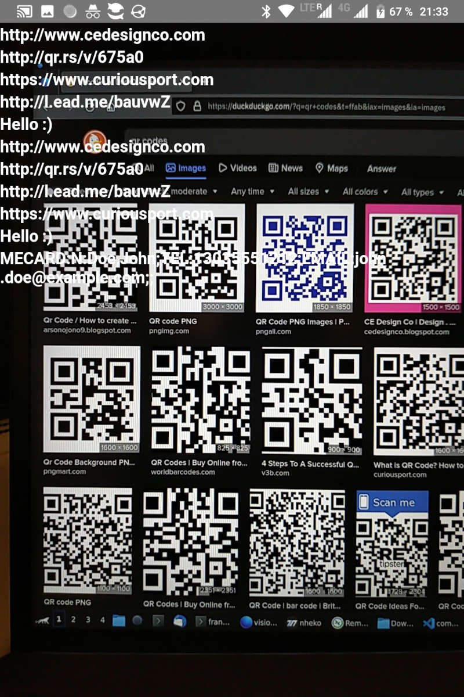

# React Native QR-Code Reader

React Native has never been an entirely smooth experience but at the moment, even a simple QR-code reader is a bit of a pain in the a**.

- [react-native-camera](https://github.com/react-native-camera/react-native-camera) is ~3 years behind
- [react-native-vision-camera](https://github.com/mrousavy/react-native-vision-camera) is the successor, with a growing number of issues
- [vision-camera-code-scanner](https://github.com/rodgomesc/vision-camera-code-scanner) is broken out of the box

Fortunately a few tweaks, and a fork, will get it working.



### Versions

- react-native: `0.71.8`
- react-native-vision-camera: `2.15.4`
- vision-camera-code-scanner: `2.15.4` + fixes

## Install

```bash
yarn
```

## Run

1st terminal:

```bash
npm start -- --reset-cache
```

2nd terminal:

```bash
export ANDROID_HOME=$HOME/Android/Sdk && \
export PATH=$PATH:$ANDROID_HOME/emulator && \
export PATH=$PATH:$ANDROID_HOME/platform-tools
npx react-native run-android
```

Note: Sometimes metro crashes; Simply start it again (`npm start -- --reset-cache`) and reload in the app.

## Development

Since we're pulling `vision-camera-code-scanner` from git, the package is not pre-built. If you need type-hints:

```bash
cd node_modules/vision-camera-code-scanner
npm run prepare
```